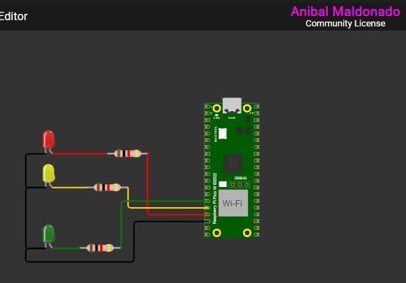

# Semáforo com Raspberry Pi Pico W

## 📌 Sobre o Projeto
Este projeto implementa um **sistema de semáforo** utilizando o **Raspberry Pi Pico W**. O semáforo alterna entre os estados **vermelho**, **amarelo** e **verde** automaticamente, com um intervalo de **3 segundos** entre as mudanças.

## 🛠️ Tecnologias Utilizadas
- **Linguagem:** C
- **Microcontrolador:** Raspberry Pi Pico W
- **Bibliotecas:**
  - `pico/stdlib.h`
  - `hardware/gpio.h`
  - `hardware/timer.h`
- **Simulador:** Wokwi
- **Compilação:** CMake

## 🚦 Como Funciona
1. O semáforo começa no **vermelho**.
2. A cada **3 segundos**, ele alterna para o próximo estado:
   - **Vermelho** → **Amarelo** → **Verde** → **Vermelho**.
3. O código utiliza um **temporizador repetitivo** para controlar as transições automaticamente.

## 🔧 Hardware Utilizado
- **Raspberry Pi Pico W**
- **3 LEDs** (vermelho, amarelo e verde)
- **3 resistores de 330Ω**
- **Fios e protoboard**

🔌 Ligações
Componente	Pino do Pico
LED Vermelho	GPIO13
LED Amarelo	GPIO12
LED Verde	GPIO11

## 🖥️ Como Instalar
1. Clone este repositório:
   
        git clone https://github.com/PhD-Anibal/semaforo.git
2. Compile o código::

       No SDK do VS code aperte em compilar segundo imagem
   
   
   
3. Com a placa BitDogLab conectada no computador em modo Bootsel envie o arquivo `.uf2` gerado

4. Esquema de conexões caso não tenha a placa BitDogLab
   
   

## 📌 Melhorias Futuras
- Implementar sensor para controle automático do semáforo.
- Criar um modo "pisca-alerta" para emergências.
- Adicionar comunicação com outros dispositivos via UART.

## 📜 Licença
Este projeto está sob a licença **MIT**.

---
✉️ **Autor:** Anibal Maldonado 🚀

